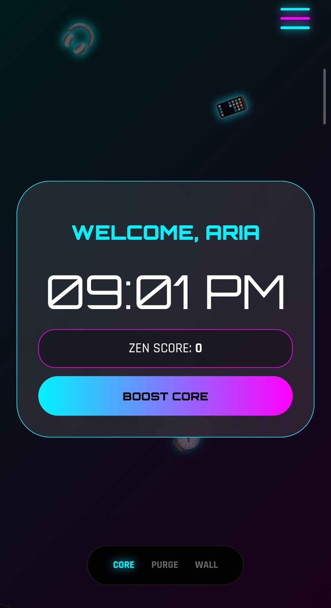
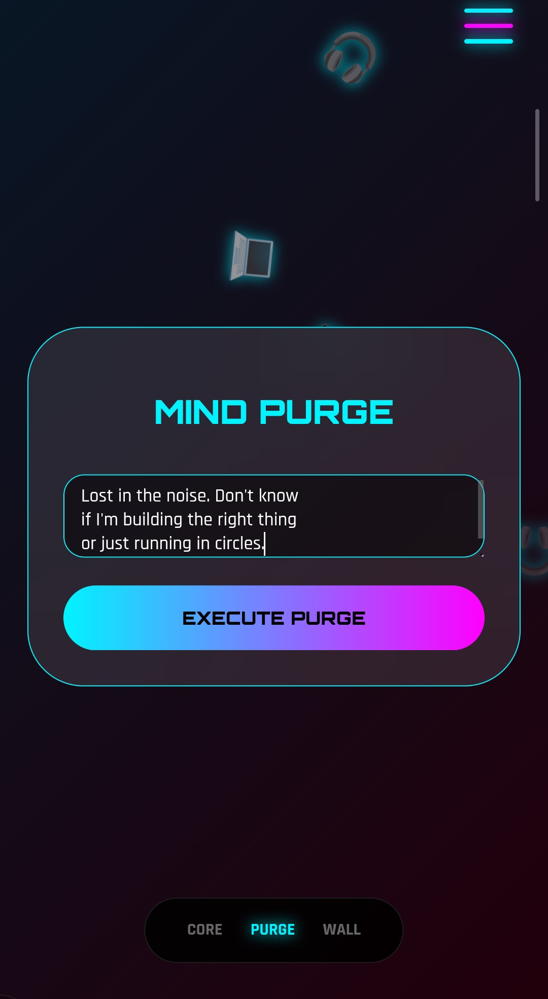
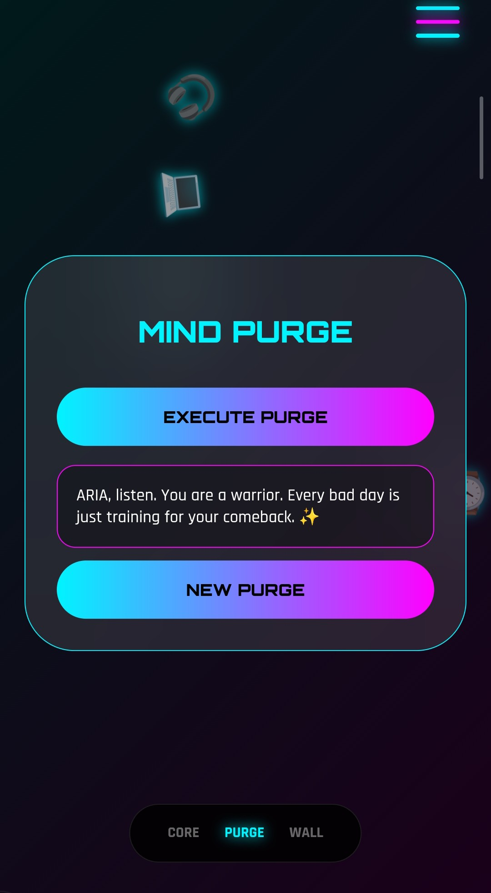
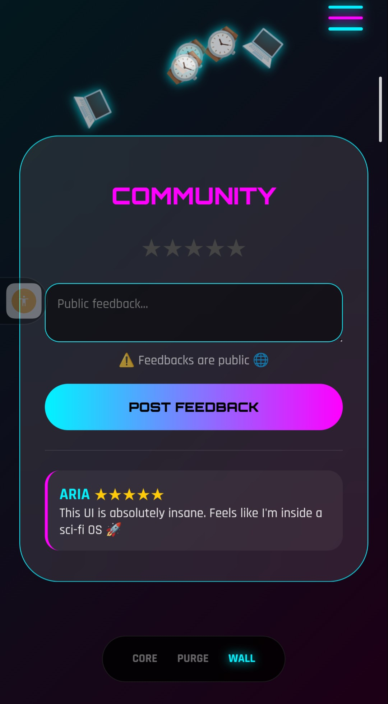
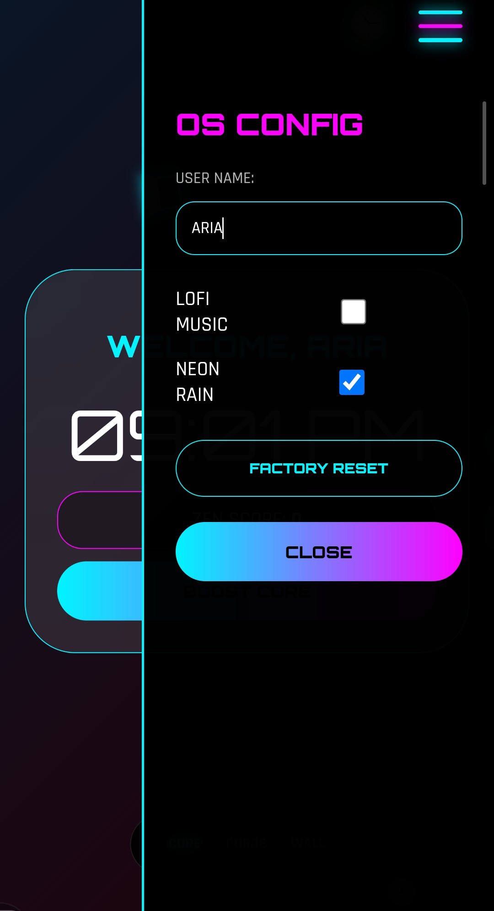

# 🧠 Aura-AI-OS — Mental Wellness OS

> *"Architecting Intelligence. Built for the ones who feel too much and rest too little."*

A futuristic, AI-themed Mental Wellness OS with a neon-tech aesthetic. Built to help users release stress, boost focus, and connect with a community.

🔗 **Live Demo:** https://gudiyalabs.github.io/Aura-AI-OS/

---

## ✨ Features

- 🧠 **CORE** — Personal dashboard with Zen Score & real-time clock
- ⚡ **MIND PURGE** — Type your stress, get an AI-style motivational response
- 🌐 **COMMUNITY WALL** — Public feedback wall with star-based posting system
- ⚙️ **OS CONFIG** — Customize username, toggle Lofi Music & Neon Rain
- 🎨 Immersive falling-objects background (MacBooks, phones, watches, headphones)

---

## 📸 Screenshots

**🧠 CORE — Personal Dashboard**

**⚡ Mind Purge — Release Your Stress**

**✨ AI Response — Your Warrior Moment**

**🌐 Community Wall — You're Not Alone**

**⚙️ OS Config — Make It Yours**

---

## 💡 Problem It Solves

People need instant emotional support but don't always have someone to talk to. Aura-AI-OS gives that — wrapped in a sci-fi experience that feels alive.

---

## 🧠 What I Learned

- Advanced JavaScript DOM manipulation
- LocalStorage for persistent user data
- CSS animations & Glassmorphism UI
- Building a gamified UX system
- Debugging complex animation + logic bugs

---

## 🚧 Coming Soon

- 🎨 Sticker Generator
- 🤖 Real AI-powered responses
- 📊 Zen Score mood tracker graph
- 🌐 Backend for persistent Wall data

---

## 🛠 Tech Used

- HTML5, CSS3, JavaScript
- LocalStorage API
- CSS Animations & Glassmorphism

---

## 👩‍💻 Built by

**Gudiya** — [@gudiyalabs](https://github.com/gudiyalabs)  
*Building the future from first principles* 🚀
